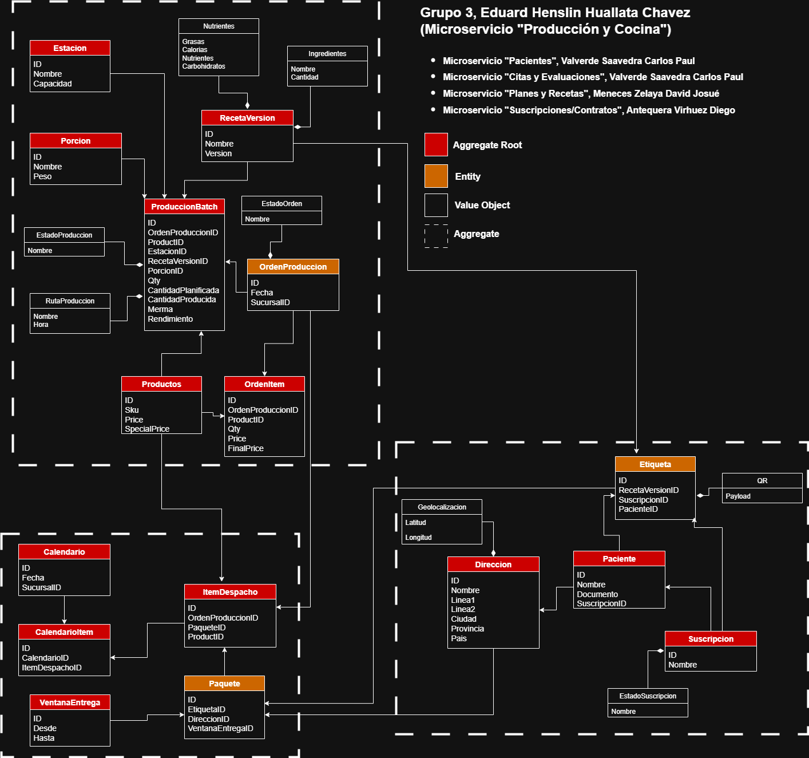

Microservicio: Producción y Cocina
Propósito

Gestionar el ciclo de vida de la Orden de Producción/Cocina desde su creación con ítems, pasando por sus 4 estados efectivos, hasta generar la lista de despacho para el siguiente microservicio.

Funcionalidades actuales

Creación de OP con ítems
Alta de la orden con su detalle (SKU y cantidades).
Validación de SKUs y snapshot de precios en los ítems (unit_price, unit_special_price, final_price).
Flujo de estados (4 estados)

CREADA → PLANIFICADA → EN_PROCESO → CERRADA.

Transiciones mediante comandos de aplicación:
GenerarOP → crea OP en CREADA.
PlanificarOP → genera batches/lotes de producción y pasa a PLANIFICADA.
IniciarOP → valida y pasa a EN_PROCESO.
CerrarOP → consolida y pasa a CERRADA.

Batches de producción
Generación de asociados a la OP durante la planificación, en función de los ítems.

Lista de despacho
Al cerrar la OP se genera la lista de despacho para el siguiente microservicio (logística/entrega).

Arquitectura
DDD + Clean Architecture + CQRS:
Agregado OrdenProduccion con colección OrderItems y VOs (Sku, Quantity).

Comandos y handlers (p. ej., GenerarOPHandler, PlanificarOPHandler, IniciarOPHandler, CerrarOPHandler).
Repositorio Eloquent para persistencia (IDs BIGINT AUTO_INCREMENT; FK order_item.op_id).

Outbox pattern:
Los eventos de dominio (p. ej., OrdenProduccionCreada, OrdenProduccionPlanificada, OrdenProduccionIniciada, OrdenProduccionCerrada) se registran en tabla outbox dentro de la misma transacción y se publican after-commit (Si los datos logran registrarse).

---

## Actividad 4 – Capa de testing (Unit + Integration) + Coverage >=80%

Este repositorio incluye:

- **Unit tests** (sin DB): lógica de Dominio + Application Handlers.
- **Integration tests** (con DB): flujos end-to-end vía HTTP (Feature tests).

### 1) Ejecutar Unit tests

```bash
php artisan test --testsuite=Unit
```

### 2) Generar Code Coverage (Unit tests)

> Requisito: tener un driver de coverage habilitado Xdebug.

```bash
php artisan test --testsuite=Unit --coverage-text --coverage-html=storage/coverage
```

El reporte HTML queda en `storage/coverage/index.html`.

**Nota:** La configuración de `phpunit.xml` limita la cobertura a `app/Domain` y `app/Application` para que el porcentaje refleje la lógica del microservicio (no el boilerplate de Laravel).

### 3) Ejecutar Integration tests (2 flujos)

```bash
php artisan test --testsuite=Feature
```

Flujos incluidos:

1. `FlujoOrdenProduccionIntegrationTest`: **generar → planificar → procesar → despachar**.
2. `EventBusIntegrationTest`: **auth + idempotencia** del endpoint `/api/event-bus`.

---
